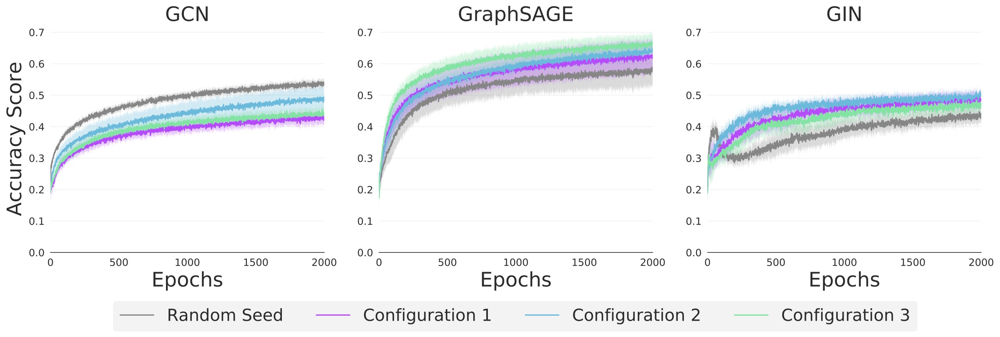

# Node Classification: Synthetic Data 🎯
This directory contains all the code for the synthetic node classification experiments.



The experiment runs can be found [here](https://www.comet.ml/graph-net-experiments/node-classification-synthetic).

## Datasets 🧩

We generate four configurations of synthetic graphs with community structure.

## Experiments 🔬
We perform six sets of transfer learning experiments:

| *#* | *Source Task*           | *Runtime argument*            |
| --- | ------------------------| ----------------------------- |
| *1* | None                    | `base`                        |
| *2* | Configuration 1         | `configuration_1`             |
| *3* | Configuration 2         | `configuration_2`             |
| *4* | Configuration 3         | `configuration_3`             |

## Running experiments🏃🏽‍♀️

Running the script `run.py` will run a batch of experiments.

Example:

```shell
  $ python run.py --model="sage" --type="configuration_1" --runs=5 --epochs=1000 --lr=0.001 --hidden_dim=100 --num_layers=5
```

The following parameters may be passed to the script when executed.
* `model`
  * The GNN to use.
  * Options: `'gcn'`, `'sage'`, `'gin'`
  * Default: `'gcn'`
  
* `type`
  * The experiment type. 
  * Options: Any of the four specified in the table above under the _Runtime argument_ column.
  * Default: `'base'`
  
* `runs`
  * The number of experiments to run. 
  * Options: Any natural number
  * Default: `10`
  
* `epochs`
  * The number of epochs to run for.
  * Options: Any natural number
  * Default: `2000`
  
* `lr`
  * The learning rate to use.
  * Options: A float between 0 and 1.
  * Default: `0.01`
  
* `hidden_dim`
  * The hidden dimensionality of the GNN network.
  * Options: A natural number.
  * Default: `256`

* `num_layers`
  * The number of GNN layers in the network.
  * Options: Any natural number
  * Default: `3`
